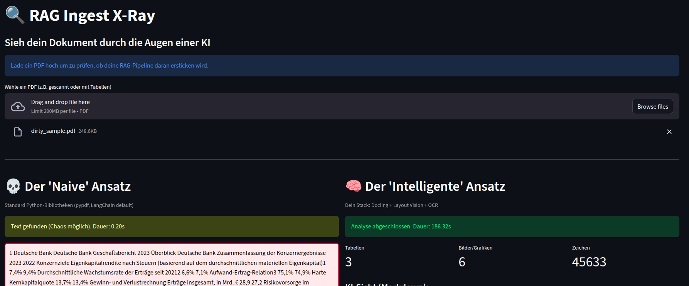
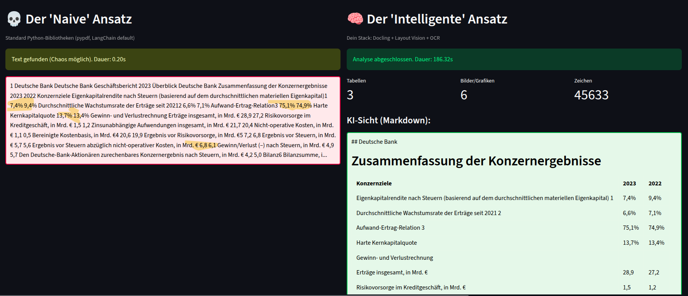

# 🔍 RAG Ingest X-Ray

**See your documents through an AI's eyes.**

A simple tool to check if your PDF will choke your RAG pipeline before you waste hours debugging.



## ⚠️ First Run Notice

**Docling downloads ML models (~2GB) on first startup.** This takes 30-60 seconds and only happens once. After that, models are cached and startup is fast.

## Quick Start

```bash
# 1. System Dependencies (for OCR)
sudo apt-get install tesseract-ocr  # Linux
# brew install tesseract              # macOS

# 2. Python Dependencies
pip install -r requirements.txt

# 3. Run
streamlit run app.py
```

Then open http://localhost:8501 and upload a PDF.

## What Does It Do?

Side-by-side comparison of two approaches:
- **💀 Naive Approach:** Standard pypdf (what 90% of RAG tutorials use)
- **🧠 Intelligent Approach:** Docling with layout-awareness & OCR



## Why?

Most RAG tutorials ignore the hard parts:
- **Scanned PDFs** (no text layer → RAG sees nothing)
- **Tables** (become garbled text soup)
- **Multi-column layouts** (wrong reading order breaks context)

This tool shows you **instantly** whether your document is "toxic" for standard RAG.

## Output

- ✅ **Green:** Standard RAG might work (but watch out for layouts)
- ❌ **Red:** You need layout-aware parsing (e.g., Docling)

## How It Works

**Naive Parsing:**
```python
reader = PdfReader(file)
text = page.extract_text()  # Hope for the best
```
Result: Chaos with tables, fails completely on scans.

**Intelligent Parsing:**
```python
converter = DocumentConverter(do_ocr=True, do_table_structure=True)
result = converter.convert(file)
markdown = result.document.export_to_markdown()  # LLMs love this
```
Result: Clean markdown with preserved structure, tables, and hierarchy.

## Tech Stack

- **Frontend:** Streamlit (interactive UI)
- **Naive Parser:** pypdf (standard library)
- **Smart Parser:** Docling (IBM Research, layout-aware)
- **OCR:** Tesseract (for scanned documents)

## Use Cases

- **Before building a RAG system:** Check if your documents are suitable
- **Debugging RAG quality issues:** See what your pipeline actually sees
- **Evaluating document ingestion strategies:** Compare approaches visually

## License

MIT - do whatever you want with it.

## Built With

Made in 3 hours to solve a real problem. If this helps you avoid the "why is my RAG hallucinating?" rabbit hole, star it! ⭐
